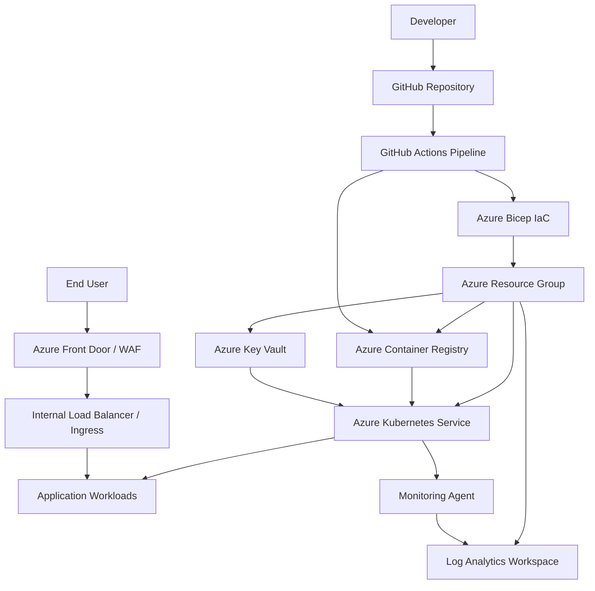
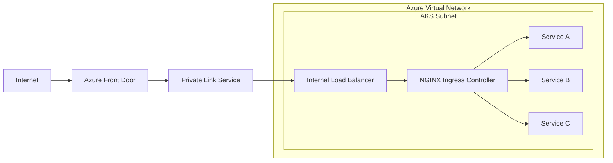

# AKS Platform Architecture

## Overview

This diagram shows a reference AKS platform architecture with CI/CD, container registry, secrets management, observability, and application workloads.

## Architecture Diagram

## Component Responsibilities

| Component | Purpose |
|---|---|
| GitHub Repository | Source code, IaC templates, pipeline definitions |
| GitHub Actions | CI/CD automation for build, test, and deploy |
| Azure Bicep | Infrastructure as Code for provisioning Azure resources |
| Azure Container Registry | Private container image storage with vulnerability scanning |
| Azure Kubernetes Service | Container orchestration and workload management |
| Azure Key Vault | Secrets, certificates, and encryption key management |
| Log Analytics Workspace | Centralized log aggregation and querying |
| Azure Front Door | Global load balancing, SSL termination, WAF protection |
| Ingress Controller | Internal traffic routing to application services |

## Networking

## Key Design Decisions

- **Private cluster** — AKS API server is not exposed to the public internet
- **Azure CNI networking** — pods get IPs from the VNet subnet for direct connectivity
- **Managed identity** — workload identity federation for pod-level Azure access
- **Key Vault CSI driver** — secrets mounted as volumes, not stored in Kubernetes Secrets
- **NGINX Ingress** — internal ingress controller behind Azure Front Door
- **Node pools** — system and user node pools separated for workload isolation
- **Cluster autoscaler** — enabled for user node pools to handle traffic spikes

## Observability Stack

| Layer | Tool |
|---|---|
| Metrics | Prometheus / Azure Monitor |
| Logs | Fluentd / Fluent Bit to Log Analytics |
| Traces | OpenTelemetry Collector to Application Insights |
| Dashboards | Grafana / Azure Workbooks |
| Alerting | Alertmanager / Azure Monitor Alerts |

## Security Controls

- Network policies restrict pod-to-pod communication
- Azure Policy enforces cluster configuration standards
- Container images scanned in ACR before deployment
- RBAC with Azure AD integration for cluster access
- Pod Security Standards enforced via admission controllers
- Secrets rotated via Key Vault with CSI driver sync