# CI/CD Architecture

## Overview

This diagram illustrates a standard CI/CD pipeline flow from code commit through production deployment with quality gates at each stage.

## Pipeline Flow

```mermaid
flowchart LR
    Dev[Developer] --> PR[Pull Request]
    PR --> Review[Code Review]
    Review --> Build[Build Pipeline]
    Build --> Test[Automated Tests]
    Test --> Scan[Security and Quality Scans]
    Scan --> Artifact[Build Artifact / Container Image]
    Artifact --> DevDeploy[Deploy to Dev]
    DevDeploy --> QA[QA Validation]
    QA --> Staging[Deploy to Staging]
    Staging --> Approval[Production Approval]
    Approval --> ProdDeploy[Deploy to Production]
    ProdDeploy --> Monitor[Post-Deployment Monitoring]
```

## Pipeline Stages

| Stage | Description |
|---|---|
| Pull Request | Developer submits code changes for review |
| Code Review | Peer review of code changes, architecture, and tests |
| Build | Compile source, resolve dependencies, generate artifacts |
| Automated Tests | Unit tests, integration tests, contract tests |
| Security Scan | SAST, dependency vulnerability scanning, container image scanning |
| Artifact Creation | Build container image, push to registry with version tag |
| Dev Deployment | Deploy to development environment for initial validation |
| QA Validation | Functional, regression, and performance testing |
| Staging Deployment | Deploy to staging for final pre-production validation |
| Production Approval | Manual approval gate before production release |
| Production Deployment | Rolling or blue-green deployment to production |
| Post-Deployment Monitoring | Validate health, metrics, logs, and error rates |

## Quality Gates

Each stage acts as a quality gate. The pipeline should halt if any gate fails:

- **Build gate** — compilation must succeed, no build warnings treated as errors
- **Test gate** — all unit and integration tests must pass
- **Security gate** — no critical or high vulnerabilities
- **Approval gate** — required approvers must sign off before production
- **Health gate** — post-deployment health checks must pass within defined timeout

## Rollback Strategy

- Automated rollback if health checks fail after deployment
- Manual rollback via pipeline redeployment of previous artifact version
- Rollback runbook should be documented and tested regularly

## Best Practices

- Pin artifact versions — never deploy `latest` tags to production
- Use environment-specific configuration — do not bake secrets into images
- Implement canary or blue-green deployments for critical services
- Keep deployment pipelines idempotent and repeatable
- Store pipeline definitions as code alongside application source