````markdown
# CI/CD Architecture

```mermaid
flowchart LR
    Dev[Developer] --> PR[Pull Request]
    PR --> Review[Code Review]
    Review --> Build[Build Pipeline]
    Build --> Test[Automated Tests]
    Test --> Scan[Security and Quality Scans]
    Scan --> Artifact[Build Artifact / Container Image]
    Artifact --> DevDeploy[Deploy to Dev]
    DevDeploy --> QA[Validation]
    QA --> Approval[Production Approval]
    Approval --> ProdDeploy[Deploy to Production]
    ProdDeploy --> Monitor[Post-Deployment Monitoring]
```



## Pipeline Stages

1. Pull request
2. Code review
3. Build
4. Test
5. Security scan
6. Artifact creation
7. Dev deployment
8. Production approval
9. Production deployment
10. Monitoring and validation