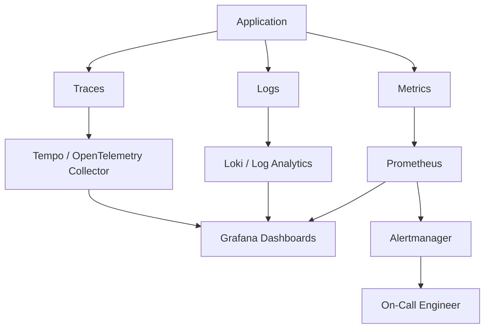

## Observability Signals

| Signal | Purpose |
|---|---|
| Metrics | Numeric measurements such as CPU, memory, latency, error rate |
| Logs | Event and application-level details |
| Traces | Request flow across distributed services |
| Alerts | Notifications for actionable reliability issues |