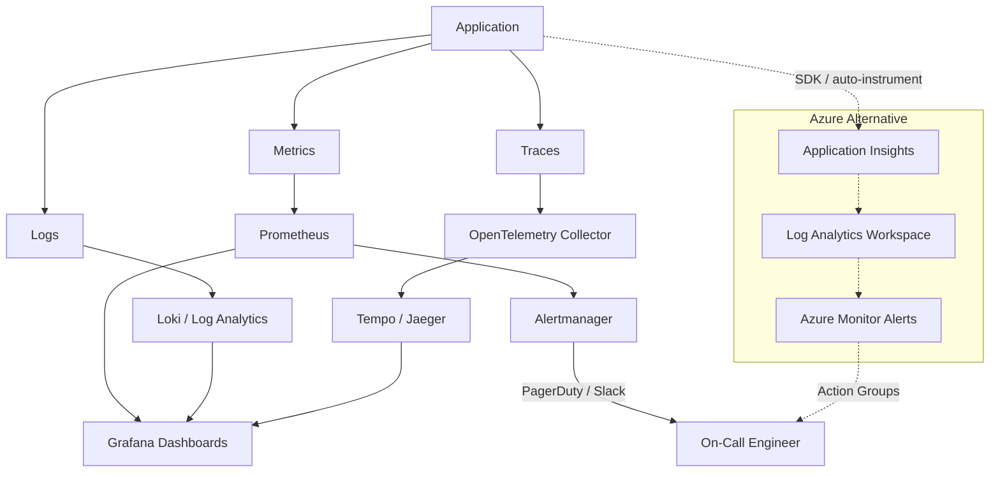

# Observability Architecture

## Overview

Observability is the ability to understand a system's internal state by examining its external outputs. A well-designed observability stack answers three questions: **What is happening?** (Metrics), **Why is it happening?** (Logs and Traces), and **Who needs to know?** (Alerts).

## Architecture Diagram

## The Three Pillars

### Metrics

Numeric time-series data. Best for dashboards, alerting, and trend analysis.

| Method | When to Use | Key Metrics |
|---|---|---|
| **RED** (Rate, Errors, Duration) | Request-driven services (APIs) | `http_requests_total`, `http_request_duration_seconds`, `http_errors_total` |
| **USE** (Utilization, Saturation, Errors) | Infrastructure resources | `node_cpu_seconds_total`, `node_memory_MemAvailable_bytes`, `node_disk_io_time_seconds_total` |
| **Golden Signals** (Latency, Traffic, Errors, Saturation) | Any service | Combination of RED + USE |

### Logs

Structured or semi-structured event records. Best for debugging and forensics.

- Use **structured logging** (JSON) for machine parsing
- Include correlation IDs for request tracing
- Ship to a centralized store (Loki, Log Analytics, ELK)
- Set retention policies to control cost

### Traces

End-to-end request flow across service boundaries. Best for latency analysis and dependency mapping.

- Instrument with **OpenTelemetry SDK** or auto-instrumentation
- Collect via **OpenTelemetry Collector** (vendor-neutral)
- Store in Tempo, Jaeger, or Application Insights
- Sample at 1-10% in production to control volume

## Observability Signals Summary

| Signal | Purpose | Tooling |
|---|---|---|
| Metrics | Numeric measurements — CPU, memory, latency, error rate | Prometheus, Azure Monitor |
| Logs | Event and application-level details | Loki, Log Analytics, ELK |
| Traces | Request flow across distributed services | OpenTelemetry, Tempo, Jaeger |
| Alerts | Notifications for actionable reliability issues | Alertmanager, Azure Monitor Alerts |

## Alert Design Principles

1. **Alert on symptoms, not causes** — alert on "error rate > 1%" not "pod restarted"
2. **Every alert must be actionable** — if the on-call engineer can't do anything, it's noise
3. **Tie alerts to SLOs** — burn-rate alerts on error budgets are more meaningful than static thresholds
4. **Use severity levels consistently:**

| Severity | Response Time | Example |
|---|---|---|
| P1 / Critical | Immediate (page) | Service down, data loss risk |
| P2 / High | Within 30 minutes | Error rate exceeds SLO, degraded performance |
| P3 / Medium | Next business day | Disk above 80%, cert expiring in 14 days |
| P4 / Low | Backlog | Non-critical warning, informational |

5. **Reduce noise** — group related alerts, use inhibition rules, tune thresholds quarterly

## Tooling Decision Matrix

| Requirement | OSS Stack | Azure-Native |
|---|---|---|
| Metrics collection | Prometheus | Azure Monitor Metrics |
| Dashboards | Grafana | Azure Dashboards / Workbooks |
| Log aggregation | Loki / ELK | Log Analytics (KQL) |
| Distributed tracing | Tempo / Jaeger | Application Insights |
| Alerting | Alertmanager | Azure Monitor Alerts + Action Groups |
| Instrumentation | OpenTelemetry | Application Insights SDK |

Choose based on your environment: OSS for Kubernetes-first, Azure-native for PaaS-heavy workloads. Both can coexist.
