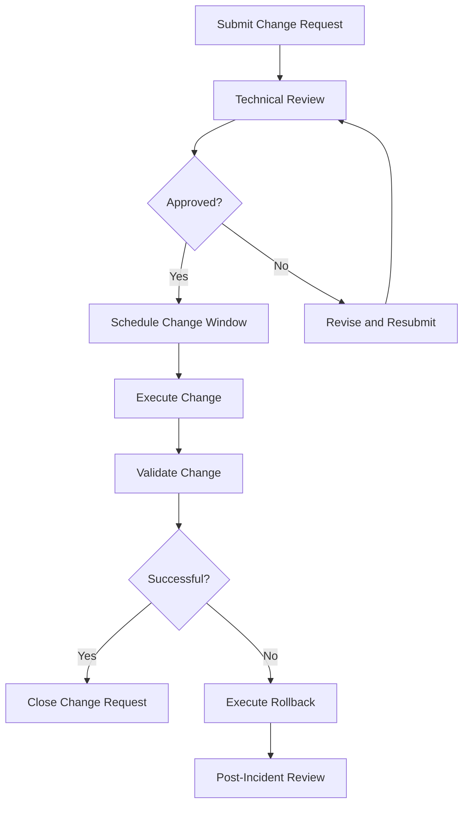

# Change Management

## Overview

Change management is the process of controlling changes to infrastructure, applications, and services to minimize risk and disruption. Effective change management balances the need for speed with the need for stability.

## Change Types

| Type | Description | Approval Required | Examples |
|---|---|---|---|
| Standard | Pre-approved, low-risk, routine changes | No (pre-approved) | Config file update, log level change |
| Normal | Planned changes that require review | Yes | Application deployment, infrastructure change |
| Emergency | Urgent changes to restore service | Expedited approval | Hotfix for production outage, security patch |

## Change Request Process



## Change Request Checklist

### Before Submitting

- [ ] Change description is clear and specific
- [ ] Business justification is documented
- [ ] Impacted services and dependencies identified
- [ ] Risk assessment completed
- [ ] Rollback plan documented and tested
- [ ] Test results from lower environments documented
- [ ] Deployment steps documented
- [ ] Communication plan prepared

### Before Executing

- [ ] All approvals obtained
- [ ] Change window confirmed
- [ ] On-call team is aware
- [ ] Monitoring dashboards ready
- [ ] Rollback plan reviewed
- [ ] Communication sent to stakeholders

### After Executing

- [ ] Validation steps completed
- [ ] Monitoring confirms normal operation
- [ ] Stakeholders notified of completion
- [ ] Change request closed
- [ ] Issues documented if any

## Change Windows

- **Standard maintenance window** — scheduled recurring windows for routine changes
- **Off-hours deployment** — changes with higher risk deployed during low-traffic periods
- **Business hours deployment** — low-risk changes that can be deployed during normal hours
- **Emergency change** — no scheduled window, executed immediately with expedited approval

## Risk Assessment

| Risk Level | Criteria | Approval |
|---|---|---|
| Low | No downtime, single service, easily reversible | Team lead |
| Medium | Brief downtime, multiple services, rollback plan exists | Manager + team lead |
| High | Extended downtime, critical services, complex rollback | CAB (Change Advisory Board) |
| Critical | Data migration, infrastructure change, security impact | CAB + executive approval |

## Communication Template

```
Subject: [Change Type] - [Brief Description] - [Date/Time]

Change ID: CR-XXXX
Environment: Production
Schedule: YYYY-MM-DD HH:MM - HH:MM UTC
Impact: [Description of expected impact]
Rollback Plan: [Brief rollback description]
Contact: [On-call engineer name and contact]
```

## Best Practices

- Automate deployments to reduce human error
- Test changes in lower environments before production
- Keep change scope small and focused
- Always have a rollback plan
- Monitor closely during and after changes
- Document lessons learned from failed changes
- Review change success rate metrics regularly
- Avoid making changes on Fridays or before holidays
