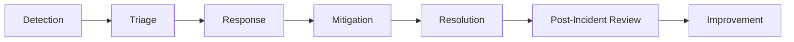

# Incident Management

## Overview

Incident management is the process of detecting, responding to, mitigating, and learning from unplanned disruptions to services. A well-defined incident management process reduces Mean Time to Detect (MTTD) and Mean Time to Resolve (MTTR).

## Incident Lifecycle



## Severity Levels

| Severity | Description | Response Time | Examples |
|---|---|---|---|
| SEV1 | Critical — complete outage or data loss | Immediate (< 15 min) | Production down, security breach, data corruption |
| SEV2 | Major — significant degradation | < 30 minutes | Partial outage, major feature broken, high error rate |
| SEV3 | Minor — limited impact | < 2 hours | Single component degraded, minor feature broken |
| SEV4 | Low — minimal impact | Next business day | Cosmetic issue, non-critical alert |

## Incident Roles

| Role | Responsibility |
|---|---|
| Incident Commander (IC) | Coordinates response, makes decisions, manages communication |
| Technical Lead | Leads investigation and troubleshooting |
| Communications Lead | Updates stakeholders, manages status page |
| Scribe | Documents timeline, actions taken, and decisions made |
| Subject Matter Expert | Provides domain-specific expertise as needed |

## Detection

Incidents can be detected through:

- **Automated alerts** — monitoring systems detect anomalies
- **Health checks** — synthetic monitoring catches failures
- **Customer reports** — users report issues through support channels
- **Internal observation** — team members notice issues in dashboards
- **Dependency alerts** — upstream or downstream service notifications

## Response Process

### 1. Acknowledge the Alert

- Acknowledge the alert in your monitoring/paging system
- Join the incident communication channel
- Declare incident severity

### 2. Assess Impact

- What services are affected?
- How many users are impacted?
- Is the issue getting worse?
- What is the business impact?

### 3. Assemble the Response Team

- Page the appropriate on-call engineers
- Assign incident roles (IC, Tech Lead, Comms)
- Bring in subject matter experts as needed

### 4. Investigate and Diagnose

- Check monitoring dashboards and alerts
- Review recent changes and deployments
- Examine logs and traces
- Test hypotheses systematically

### 5. Mitigate

- Apply the fastest available fix to restore service
- Common mitigations: rollback, restart, scale up, failover, config change
- Mitigation does not need to be the permanent fix

### 6. Communicate

- Update stakeholders at regular intervals
- Update the status page
- Notify affected customers if applicable

### 7. Resolve and Close

- Confirm service is fully restored
- Monitor for recurrence
- Close the incident ticket
- Schedule the post-incident review

## Communication Templates

### Initial Notification

```
[SEV-X] Incident: [Brief Description]
Impact: [What users are experiencing]
Status: Investigating
Next Update: [Time]
```

### Status Update

```
[SEV-X] Incident Update: [Brief Description]
Status: [Investigating / Mitigating / Resolved]
Current Impact: [What users are experiencing now]
Actions Taken: [What we have done so far]
Next Steps: [What we are doing next]
Next Update: [Time]
```

### Resolution

```
[SEV-X] Incident Resolved: [Brief Description]
Duration: [Start time to resolution time]
Impact: [Summary of impact]
Root Cause: [Brief root cause if known]
Follow-Up: Post-incident review scheduled for [Date]
```

## Post-Incident Review

Every SEV1 and SEV2 incident should have a blameless postmortem:

1. Document the incident timeline
2. Identify the root cause
3. Document what went well and what went wrong
4. Create action items to prevent recurrence
5. Share findings with the broader team

See [Postmortem Template](../templates/postmortem-template.md) for the standard format.

## Key Metrics

| Metric | Description |
|---|---|
| MTTD (Mean Time to Detect) | Time from incident start to detection |
| MTTA (Mean Time to Acknowledge) | Time from alert to acknowledgment |
| MTTR (Mean Time to Resolve) | Time from detection to resolution |
| Incident count by severity | Trend of incidents over time |
| Postmortem completion rate | Percentage of incidents with completed postmortems |
| Action item completion rate | Percentage of postmortem actions completed on time |

## Best Practices

- Practice incident response through game days and tabletop exercises
- Keep runbooks up to date and accessible
- Maintain an on-call rotation with clear escalation paths
- Conduct blameless postmortems — focus on systems, not individuals
- Track and trend incident metrics over time
- Automate common mitigations where possible
